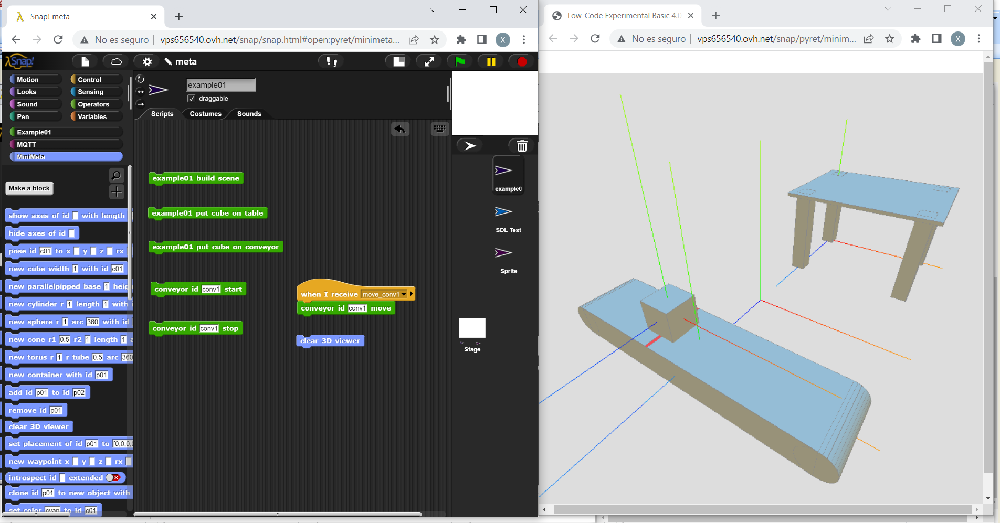

# meta4snap

Snap *!* controlled minimal 4.0 metaverse, for educational and evangelization purposes.
In consists of a 3D visor based on [three.js](https://threejs.org) and a Snap *!* library that comunicates to visor by MQTT.

## [Try it](https://pixavier.github.io/meta4snap)

This demo uses a public MQTT broker. The response time can be dramatically improved using a local MQTT broker, such as the [Mosquitto broker](https://mosquitto.org), a popular open-source option available for Linux, Windows, and Mac, fast and easy to install. The "delay" variable can be set to 0 if the MQTT broker is fast enough. To access an MQTT broker from a browser [WebSockets support must be activated on the broker](http://www.steves-internet-guide.com/mqtt-websockets).

[MQTT Explorer](http://mqtt-explorer.com) is an excellent free tool to monitor broker activity.

This project is inspired by projects like [BeetleBlocks](http://beetleblocks.com).
