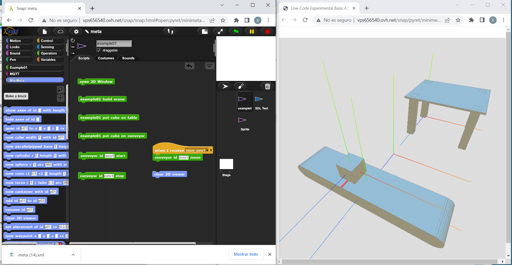

# meta4snap

Snap *!* controlled minimal 4.0 metaverse, for educational and evangelization purposes.

## [Try it](https://pixavier.github.io/meta4snap)

In consists of a 3D visor based on [three.js](https://threejs.org) and a Snap *!* library that comunicates to visor by MQTT.

It has been inspired by projects like [BeetleBlocks](http://beetleblocks.com).
